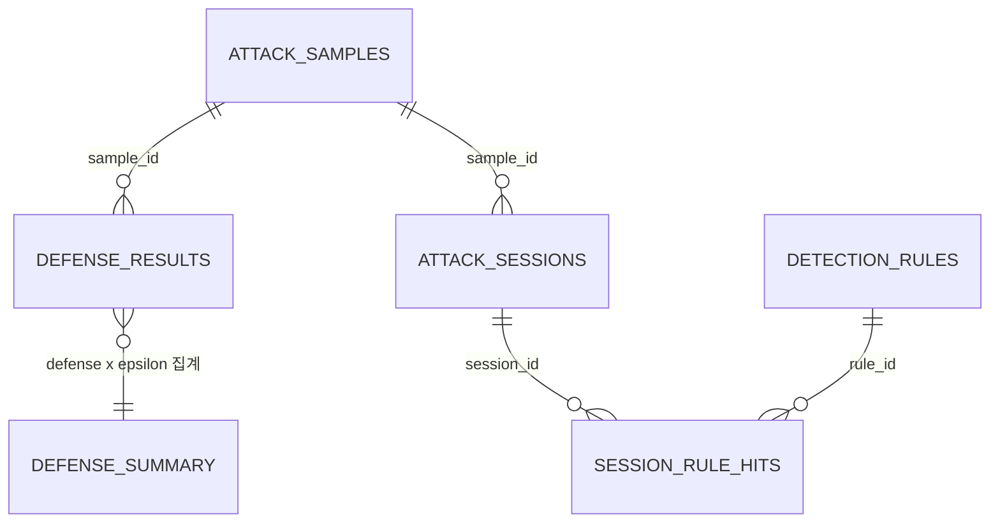

# DB_SCHEMA — 금융 생체인증 적대적 공격·방어 탐지 플랫폼

| 항목 | 내용 |
|------|------|
| 문서명 | DB_SCHEMA.md |
| 버전 | v1.0 |
| 최종 수정일 | 2026-07-07 |
| DB 엔진 | PostgreSQL 16 (권장) |

---

## 0. 설계 원칙

| 원칙 | 설명 |
|------|------|
| 정밀도 우선 | cosine similarity 등 수치는 `NUMERIC(12,8)`. `FLOAT` 사용 금지 |
| 스냅샷 보존 | 공격·방어 실행 결과는 변경 불가 snapshot으로 저장. 원본 데이터 변경 후에도 재현 가능 |
| 논리 삭제 | 비즈니스 데이터는 soft delete (`is_deleted` 컬럼). 물리 삭제는 관리자 전용 |
| 타임존 정책 | 모든 `TIMESTAMPTZ` 값은 UTC 기준 저장. 클라이언트는 UTC 전송, 표시 시 로컬 변환 |
| 공통 threshold | EER 기준 0.47966246581077576 — 모든 테이블에서 동일 값 사용 |

---

## 1. ER 다이어그램



---

## 2. 테이블 정의

### 2-1. attack_samples
공격팀이 생성한 적대적 샘플 메타데이터. `attack_handoff_index.csv` 기반.

```sql
CREATE TABLE attack_samples (
    sample_id               VARCHAR(64)      PRIMARY KEY,
    pair_id                 VARCHAR(32)      NOT NULL,
    attack                  VARCHAR(64)      NOT NULL,
    model                   VARCHAR(128)     NOT NULL,
    pretrained              VARCHAR(64)      NOT NULL,
    source_name             VARCHAR(128)     NOT NULL,
    target_name             VARCHAR(128)     NOT NULL,
    epsilon                 NUMERIC(12,8)    NOT NULL,
    alpha                   NUMERIC(12,8),
    steps                   INT,
    threshold               NUMERIC(12,8)    NOT NULL DEFAULT 0.47966247,
    similarity_before       NUMERIC(12,8)    NOT NULL,
    similarity_after_attack NUMERIC(12,8)    NOT NULL,
    similarity_gain         NUMERIC(12,8)    GENERATED ALWAYS AS (similarity_after_attack - similarity_before) STORED,
    accepted_before         BOOLEAN          NOT NULL,
    accepted_after_attack   BOOLEAN          NOT NULL,
    attack_success_before_defense BOOLEAN    NOT NULL,
    l2                      NUMERIC(12,8),
    linf                    NUMERIC(12,8),
    time_sec                NUMERIC(10,4),
    source_file             TEXT,
    target_enroll_file      TEXT,
    adv_file                TEXT,
    perturbation_file       TEXT,
    is_jpeg_reloaded        BOOLEAN          NOT NULL DEFAULT FALSE,
    created_at              TIMESTAMPTZ      NOT NULL DEFAULT NOW()
);

CREATE INDEX idx_attack_samples_epsilon ON attack_samples (epsilon);
CREATE INDEX idx_attack_samples_accepted ON attack_samples (accepted_after_attack);
```

> **is_jpeg_reloaded**: JPEG 파일 재로드 기준으로 `similarity_after_attack`, `accepted_after_attack`을 재계산한 경우 `TRUE`. eps=0.005 perturbation(±1.275px)이 JPEG 양자화 오차(±2~5px)에 흡수되는 문제 대응.

---

### 2-2. defense_results
방어팀 3종 방어(jpeg·smoothing·bitdepth) 적용 결과. `facenet_verification_defense_results.csv` 기반.

```sql
CREATE TYPE defense_method AS ENUM ('jpeg', 'smoothing', 'bitdepth');

CREATE TABLE defense_results (
    id                          BIGSERIAL        PRIMARY KEY,
    sample_id                   VARCHAR(64)      NOT NULL REFERENCES attack_samples(sample_id),
    defense                     defense_method   NOT NULL,
    defense_params              JSONB,
    threshold                   NUMERIC(12,8)    NOT NULL DEFAULT 0.47966247,
    similarity_after_attack     NUMERIC(12,8)    NOT NULL,
    similarity_after_defense    NUMERIC(12,8)    NOT NULL,
    accepted_after_attack       BOOLEAN          NOT NULL,
    accepted_after_defense      BOOLEAN          NOT NULL,
    attack_success_after_defense BOOLEAN         NOT NULL,
    defense_success             BOOLEAN          NOT NULL,
    defense_time_sec            NUMERIC(10,6),
    adv_file                    TEXT,
    defended_file               TEXT,
    target_enroll_file          TEXT,
    created_at                  TIMESTAMPTZ      NOT NULL DEFAULT NOW(),

    UNIQUE (sample_id, defense)
);

CREATE INDEX idx_defense_results_sample ON defense_results (sample_id);
CREATE INDEX idx_defense_results_defense ON defense_results (defense);
CREATE INDEX idx_defense_results_success ON defense_results (defense_success);
```

> **defense_success 판정 기준**: `accepted_after_attack = TRUE AND accepted_after_defense = FALSE`

---

### 2-3. attack_sessions
공격 결과를 인증 세션 로그 형태로 재구성한 포렌식 산출물. `attack_sessions.csv` 기반.

```sql
CREATE TYPE risk_level AS ENUM ('low', 'medium', 'high', 'critical');

CREATE TABLE attack_sessions (
    session_id          VARCHAR(64)      PRIMARY KEY,
    sample_id           VARCHAR(64)      NOT NULL REFERENCES attack_samples(sample_id),
    account_id          VARCHAR(128)     NOT NULL,
    threshold_margin    NUMERIC(12,8)    NOT NULL,
    defense_bypassed    BOOLEAN          NOT NULL DEFAULT FALSE,
    risk_score          NUMERIC(6,2)     NOT NULL CHECK (risk_score >= 0 AND risk_score <= 100),
    risk_level          risk_level       NOT NULL,
    created_at          TIMESTAMPTZ      NOT NULL DEFAULT NOW()
);

CREATE INDEX idx_sessions_risk_level ON attack_sessions (risk_level);
CREATE INDEX idx_sessions_risk_score ON attack_sessions (risk_score DESC);
CREATE INDEX idx_sessions_account ON attack_sessions (account_id);
```

---

### 2-4. detection_rules
FA-R001~FA-R008 탐지 룰 정의. `attack_detection_rules.json` 기반.

```sql
CREATE TABLE detection_rules (
    rule_id     VARCHAR(16)      PRIMARY KEY,
    rule_name   VARCHAR(64)      NOT NULL UNIQUE,
    condition   TEXT             NOT NULL,
    weight      NUMERIC(6,2)     NOT NULL CHECK (weight >= 0),
    description TEXT,
    created_at  TIMESTAMPTZ      NOT NULL DEFAULT NOW()
);

INSERT INTO detection_rules (rule_id, rule_name, condition, weight, description) VALUES
    ('FA-R001', 'threshold_spike',        'similarity > threshold + 0.05',           20.0, 'threshold를 크게 초과한 고확신 공격'),
    ('FA-R002', 'borderline_attempt',     'threshold - 0.02 < similarity <= threshold', 10.0, 'threshold 경계 근처 반복 시도'),
    ('FA-R003', 'high_query_blackbox',    'queries_used > 500',                      15.0, '블랙박스 고쿼리 패턴'),
    ('FA-R004', 'strong_defense_bypass',  'defense_bypassed = TRUE AND risk_score > 60', 25.0, '방어 우회 고위험 세션'),
    ('FA-R005', 'multi_target_source',    'source가 3개 이상 target 시도',            20.0, '동일 source의 다중 target 공격'),
    ('FA-R006', 'high_risk_target',       'target이 반복 공격 대상',                  15.0, '고위험 계정 반복 공격'),
    ('FA-R007', 'look_alike_hard_negative','similarity_before > 0.35',               10.0, '유사 외모 source 활용 공격'),
    ('FA-R008', 'low_norm_success',       'accepted_after_attack = TRUE AND linf < 0.006', 20.0, '낮은 perturbation으로 성공한 고효율 공격');
```

---

### 2-5. session_rule_hits
세션과 탐지 룰 간 N:M 관계 테이블.

```sql
CREATE TABLE session_rule_hits (
    id          BIGSERIAL    PRIMARY KEY,
    session_id  VARCHAR(64)  NOT NULL REFERENCES attack_sessions(session_id),
    rule_id     VARCHAR(16)  NOT NULL REFERENCES detection_rules(rule_id),
    hit_at      TIMESTAMPTZ  NOT NULL DEFAULT NOW(),

    UNIQUE (session_id, rule_id)
);

CREATE INDEX idx_rule_hits_session ON session_rule_hits (session_id);
CREATE INDEX idx_rule_hits_rule ON session_rule_hits (rule_id);
```

---

### 2-6. defense_summary
방어 기법 × epsilon 구간별 집계 테이블. `verification_defense_summary.csv` 기반.

```sql
CREATE TABLE defense_summary (
    id                      BIGSERIAL       PRIMARY KEY,
    defense                 defense_method  NOT NULL,
    epsilon                 VARCHAR(8)      NOT NULL,
    samples                 INT             NOT NULL,
    n_attack_success        INT             NOT NULL,
    attack_success_rate     NUMERIC(6,4)    NOT NULL,
    n_defense_success       INT             NOT NULL,
    defense_success_rate    NUMERIC(6,4)    NOT NULL,
    n_still_attack          INT             NOT NULL,
    still_attack_rate       NUMERIC(6,4)    NOT NULL,
    avg_sim_after_attack    NUMERIC(12,8),
    avg_sim_after_defense   NUMERIC(12,8),
    avg_sim_drop            NUMERIC(12,8),
    avg_defense_time_sec    NUMERIC(10,6),
    created_at              TIMESTAMPTZ     NOT NULL DEFAULT NOW(),

    UNIQUE (defense, epsilon)
);
```

---

## 3. 공통 key 정의

| Key | 타입 | 설명 | 참조 테이블 |
|-----|------|------|------------|
| sample_id | VARCHAR(64) | 샘플 고유 ID | attack_samples(PK), defense_results(FK), attack_sessions(FK) |
| session_id | VARCHAR(64) | 인증 세션 고유 ID | attack_sessions(PK), session_rule_hits(FK) |
| rule_id | VARCHAR(16) | 탐지 룰 고유 ID | detection_rules(PK), session_rule_hits(FK) |
| threshold | NUMERIC(12,8) | EER 기준 cosine similarity 임계값 (0.47966246581077576) | 모든 테이블 공통 |

---

## 4. 데이터 흐름

```
공격팀
  attack_samples ──────────────────────────────┐
       │                                        │
       ▼                                        ▼
  attack_sessions                         defense_results
       │                                        │
       ▼                                        ▼
  session_rule_hits ← detection_rules    defense_summary
       │
       ▼
  대시보드 (PostgreSQL → FastAPI → React/Vue.js)
```
