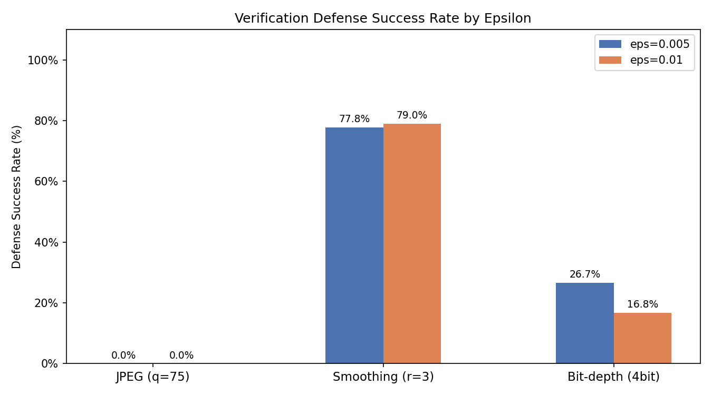
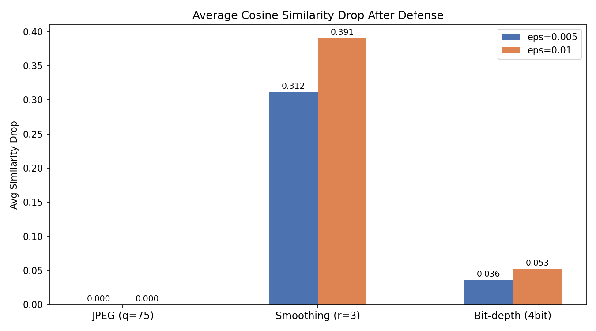
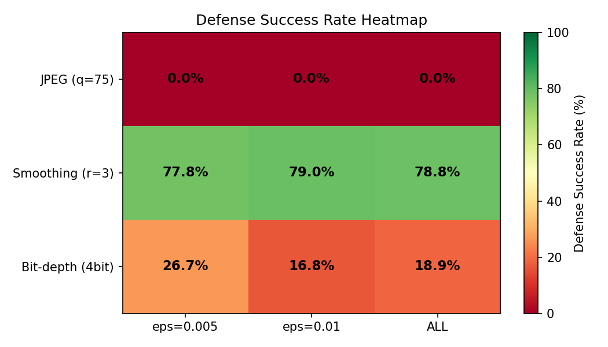

# Verification 기반 방어 평가 보고서

### 이행 내역

| 요구사항 | 이행 방법 | 관련 파일 |
|---------|---------|---------|
| attack_handoff_index.csv 각 row 기준 방어 적용 | index CSV 전체 212행 순회하며 방어 적용 | `verification_defense_base.py` |
| adv_file을 방어 입력으로 사용 | 각 행의 `adv_file` 경로로 이미지 로드 후 변환 | `verification_defense_base.py` |
| defended_file과 target_enroll_file의 FaceNet cosine similarity 계산 | `get_embedding()` 으로 두 이미지 임베딩 추출 후 cosine similarity 계산 | `facenet_embed.py` |
| threshold 기준 공격 유지 / 방어 성공 판정 | `accepted_after_defense = similarity >= threshold` | `verification_defense_base.py` |
| eps=0.005, eps=0.010 successful 212개 샘플 처리 | 패키지 그대로 사용, missing files 0개 확인 | `build_jpeg_index.py` |
| facenet_verification_defense_results.csv 반환 | 방어 3종 결과 합본 CSV 생성 (636행) | `facenet_verification_defense_results.csv` |

### 출력 파일 구조

```
outputs/verification_defense/
  facenet_verification_defense_results.csv     ← 전체 합본 (공격팀 전달용, 636행)
  jpeg/verification_defense_jpeg.csv           ← JPEG 방어 단독 (212행)
  smoothing/verification_defense_smoothing.csv ← Smoothing 방어 단독 (212행)
  bitdepth/verification_defense_bitdepth.csv   ← Bitdepth 방어 단독 (212행)
```

### 출력 CSV 컬럼 설명

| 컬럼 | 설명 |
|------|------|
| `sample_id` | 샘플 고유 ID |
| `defense` | 방어 기법명 (jpeg / smoothing / bitdepth) |
| `defense_params` | 방어 파라미터 (JSON) |
| `adv_file` | 입력 공격 이미지 경로 |
| `defended_file` | 방어 적용 후 저장된 이미지 경로 |
| `target_enroll_file` | 타겟 등록 이미지 경로 |
| `threshold` | EER 기준 threshold (0.47966) |
| `similarity_after_attack` | 방어 전 similarity (JPEG 파일 기준 재계산) |
| `similarity_after_defense` | 방어 후 similarity |
| `accepted_after_attack` | 방어 전 인증 통과 여부 |
| `accepted_after_defense` | 방어 후 인증 통과 여부 |
| `attack_success_after_defense` | 방어 후에도 공격 성공 여부 |
| `defense_success` | 방어 성공 여부 |
| `defense_time_sec` | 방어 처리 시간 (초) |

## 2. 실험 개요

### 목표
- 금융 생체인증 환경 가정
- FaceNet 얼굴 verification 모델 대상 targeted adversarial impersonation attack에 전처리 방어 3종 적용
- 방어 기법 간 성능 비교 분석

### 실험 조건

| 항목 | 내용 |
|------|------|
| 공격 방식 | Targeted PGD (FaceNet verification 기반) |
| 임베딩 모델 | `facenet-pytorch / InceptionResnetV1`, pretrained=`vggface2` |
| Threshold | **0.47966** (EER 기준, `verification_metrics.json` 참고) |
| 전체 샘플 | 212개 (eps=0.005: 45개, eps=0.010: 167개) |
| 방어 기법 | JPEG 압축 / Gaussian Smoothing / Bit-depth 축소 |

### 방어 성공 판정 기준

```
accepted_after_attack  = similarity_after_attack  >= threshold
accepted_after_defense = similarity_after_defense >= threshold

defense_success = accepted_after_attack == True  AND  accepted_after_defense == False
```

- 공격 성공 샘플에 방어 적용 후 인증이 다시 REJECT 되어야 방어 성공으로 판정

---

## 3. Verification 전환 시 발생한 문제 — JPEG 압축 이슈

### 문제
- 공격팀 adv 이미지(`.jpg`) 파일을 직접 불러와 similarity를 계산하면 CSV 기록값과 차이 발생

### 원인
- 공격팀: `similarity_after_attack`을 **텐서 단계(메모리 상)** 에서 측정 후 `.jpg`로 저장
- eps=0.005 perturbation 크기: 픽셀당 최대 **±1.275**
- JPEG 압축 오차: 픽셀당 **±2~5** → perturbation보다 큰 오차로 perturbation 덮어씌워짐

```
공격팀 계산 시점:  tensor 단계  →  similarity 기록 (공격 성공)
파일 저장 시점:    JPEG 압축    →  perturbation 일부 소실
방어팀 계산 시점:  JPEG 재로드  →  similarity 감소  →  일부 샘플은 이미 공격 실패 상태
```

### 검증 결과

| 이미지 유형 | CSV 기록값 | 우리 계산값 | 차이 |
|------------|-----------|------------|------|
| source vs enroll (정상 이미지) | 0.2567 | 0.2556 | **0.001** (정상) |
| adv vs enroll (eps=0.005) | 0.5183 | 0.4594 | **0.059** (손상) |

- source 이미지 값 일치 → 전처리 방식 자체는 동일
- 차이는 JPEG 압축으로 인한 perturbation 손상에서 발생

### 영향 범위

| 기준 | 공격 성공 | 공격 실패 |
|------|---------|---------|
| 공격팀 CSV (tensor 기준) | 212개 (100%) | 0개 |
| JPEG 파일 재로드 (방어팀 계산) | **171개 (80.7%)** | **41개 (19.3%)** |

### 대응
- `similarity_after_attack`, `accepted_after_attack`을 JPEG 파일 기준으로 재계산
- `attack_handoff_jpeg_index.csv`로 저장 후 모든 평가를 재계산된 값 기준으로 진행

> 근본 해결: 공격팀에 adv 이미지 PNG 재전달 요청 → 8절 참고

---

## 4. 방어 기법 적용 방식

### 공통 파이프라인

```
attack_handoff_jpeg_index.csv
        ↓
adv_file 로드 (JPEG, 160×160)
        ↓
방어 변환 적용
        ↓
defended_file 저장
        ↓
FaceNet 임베딩 추출 (InceptionResnetV1 vggface2)
  전처리: 160×160 resize (BILINEAR) + (pixel - 127.5) / 128.0 정규화
        ↓
cosine_similarity(defended_embedding, target_enroll_embedding)
        ↓
>= 0.47966 → ACCEPT  /  < 0.47966 → REJECT
```

### 방어별 변환 로직

| 방어 | 파라미터 | 변환 방식 |
|------|---------|---------|
| **JPEG 압축** | quality=75 | PIL로 JPEG 재압축 |
| **Gaussian Smoothing** | radius=3 | PIL GaussianBlur |
| **Bit-depth 축소** | bits=4 | `(pixel >> 4) << 4` (8bit → 4bit 양자화) |

### 소스코드 구조

```
src/defenses/
  facenet_embed.py                  ← FaceNet 임베딩 유틸
  verification_defense_base.py      ← 평가 공통 로직
  verification_defense_jpeg.py      ← JPEG 방어
  verification_defense_smoothing.py ← Smoothing 방어
  verification_defense_bitdepth.py  ← Bit-depth 방어
  verification_summarize.py         ← 집계
  verification_plot.py              ← 시각화 + 보고서
  build_jpeg_index.py               ← attack_handoff_jpeg_index.csv 생성
```

---

## 5. 실험 결과

### 방어 성공률 (defense_success_rate)

| 방어 | eps=0.005 | eps=0.010 | **전체** |
|------|-----------|-----------|---------|
| JPEG (q=75) | 0.0% | 0.0% | **0.0%** |
| Smoothing (r=3) | 77.8% | 79.0% | **78.8%** |
| Bit-depth (4bit) | 26.7% | 16.8% | **18.9%** |

### 방어 후 공격 성공률 (ASR after defense)

| 방어 | eps=0.005 | eps=0.010 | **전체** |
|------|-----------|-----------|---------|
| JPEG (q=75) | 80.0% | 80.8% | **80.7%** |
| Smoothing (r=3) | 2.2% | 1.8% | **1.9%** |
| Bit-depth (4bit) | 53.3% | 64.1% | **61.8%** |

### 평균 Similarity 변화 (전체 기준)

| 방어 | 방어 전 | 방어 후 | 감소량 |
|------|--------|--------|-------|
| JPEG (q=75) | 0.5467 | 0.5465 | **0.0002** |
| Smoothing (r=3) | 0.5467 | 0.1729 | **0.3738** |
| Bit-depth (4bit) | 0.5467 | 0.4976 | **0.0491** |

---

## 6. 시각화

### 방어 성공률 비교 (epsilon별)



### 평균 Cosine Similarity 감소량



### 방어 성공률 히트맵



---

## 7. 방어 기법별 성능 분석

### JPEG 압축 — 0.0% (사실상 방어 불가)

- adv 이미지가 이미 JPEG로 저장된 상태 → 중복 압축 적용에 불과
- 두 번째 압축은 첫 번째 압축의 양자화 경계를 거의 그대로 유지 → similarity 변화 없음
- 방어 전후 similarity 감소량 평균 **0.0002** (사실상 0)
- adv 이미지가 PNG로 전달됐다면 JPEG 압축(±2~5px 오차)이 perturbation(±1.275px)을 덮어 방어 효과 발휘 가능

---

### Gaussian Smoothing — 78.8% (가장 효과적)

- Gaussian blur: 픽셀 주변 영역을 가우시안 가중치로 평균화 → **고주파 성분 제거**
- Adversarial perturbation = 사람 눈에 보이지 않는 고주파 노이즈 → blur로 자연스럽게 희석
- eps 크기와 무관하게 일관된 성능 (77.8% vs 79.0%) → perturbation 크기에 덜 민감
- similarity 평균 감소량 **0.374** → 방어 후 similarity가 threshold를 크게 밑돎
- eps=0.010에서 성공률이 더 높은 이유: 큰 perturbation일수록 blur로 더 크게 희석됨
- **한계**: blur 강도 ↑ → 정상 얼굴 디테일 손상 → FRR 증가 가능. radius=3은 방어력·얼굴 품질 균형점

---

### Bit-depth 축소 — 18.9% (낮은 효과)

- 4-bit 양자화: 픽셀값을 16단계 간격(step=16)으로 뭉갬
- eps=0.010 perturbation 최대 변화: **±2.55px** < 양자화 step(16) → perturbation이 step 범위 안에 들어감
- 올림/버림 방향에 따라 perturbation 제거될 수도, 보존될 수도 있음 → 결과 불규칙
- eps가 클수록 성공률이 낮아진 이유 (eps=0.005: 26.7% → eps=0.010: 16.8%): 큰 perturbation이 양자화 경계를 넘어 threshold 위에 안착하는 경우 증가
- **개선 방안**: bits=2(step=64)로 줄이면 방어력 상승 가능하나 얼굴 디테일 손상으로 FRR 증가 우려

---

## 8. Adversarial Training 계획 (미적용)

### 현재 상태
- 기존 `defense_adv_training.py`: ResNet-50 분류기 + CrossEntropyLoss 기준 학습
- FaceNet verification 공격에 직접 적용 불가

### 적용 계획

**Loss 변경**:

```python
# 기존 (classification)
loss = CrossEntropyLoss(pred, true_label)

# 변경 (verification)
loss = 1 - cosine_similarity(
    embedding(adv_image),
    embedding(clean_image)
)
# 목표: adv 이미지의 embedding이 clean 이미지와 같아지도록
```

**학습 데이터**:
- `(source_image, adv_image)` 쌍 사용
- 현재 패키지의 adversarial 이미지 활용
- 최소 500쌍 이상 필요 (현재 212개 → 공격팀 추가 생성 요청 필요)

**구현 순서**:
1. 공격팀에 학습용 `(source, adv)` 쌍 추가 요청
2. `defense_adv_training.py` 수정 — FaceNet 로드 + loss 교체
3. fine-tune 후 전처리 3종과 성능 비교

**예상 효과**:
- 모델 자체가 adversarial perturbation에 강인해짐 → 더 강한 공격에도 안정적 방어
- 이미지를 흐리게 하지 않으므로 FRR에 영향 최소화 기대

---

## 9. 추후 진행할 사항

### (1) adv 이미지 PNG 재전달 — 최우선
- 현재 상황: JPEG 저장으로 eps=0.005 공격 **41개(19.3%)** 가 파일 단계에서 이미 공격 실패
- 문제: JPEG 방어 평가 불가, 전체 평가 신뢰성 저하
- **요청**: `samples/` 폴더의 adversarial 이미지를 PNG 형식으로 재저장 후 전달
  - 단, 원본 tensor 파일 보유 시에만 가능

### (2) 다양한 공격 종류 추가 전달
- 현재 상황: PGD 공격만 포함
- 문제: 방어 비교 실험의 일반성 부족
- **요청**: FGSM, SQUARE 등 다른 verification 공격 결과를 동일 포맷(`attack_handoff_index.csv`)으로 전달

### (3) Adversarial Training용 학습 데이터
- 현재 상황: (source, adv) 쌍 212개로 학습 데이터 부족
- **요청**: 학습용 (source, adv) 쌍 추가 생성 협의
  - 최소 500쌍 이상 권장

---

## 10. 한계점 및 향후 과제

| 한계 | 내용 |
|------|------|
| JPEG 손상 | eps=0.005 adv 이미지 41개 파일 단계에서 공격 실패 → 평가 왜곡 가능성 |
| 단일 공격 종류 | PGD만 평가, FGSM/SQUARE 등 타 공격에서의 성능 미확인 |
| FRR 미측정 | 방어가 정상 이미지 인증에 미치는 영향(FRR 변화) 미측정 |
| Adversarial Training 미완 | verification loss 기반 재학습 미진행 |
| 생성형 방어 미구현 | DAE / DiffPure 등 생성형 정화 방어 미적용 |

---
